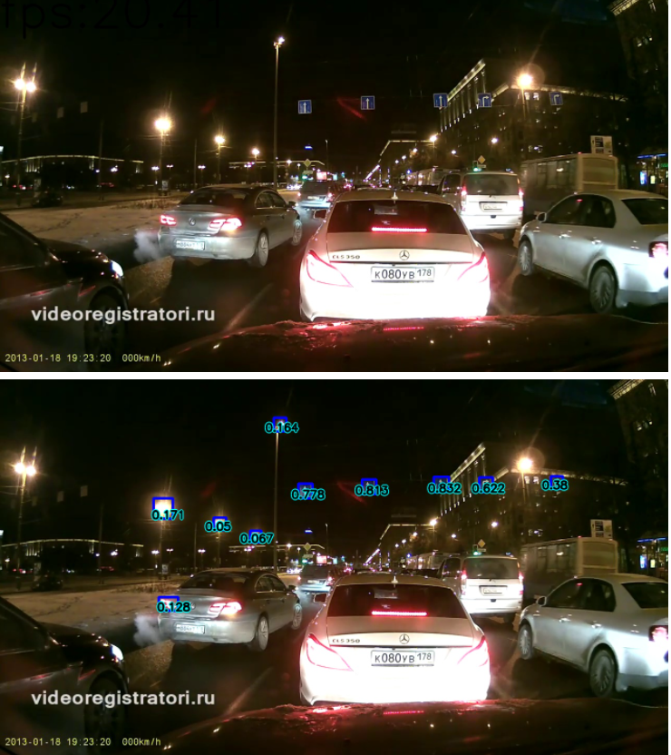
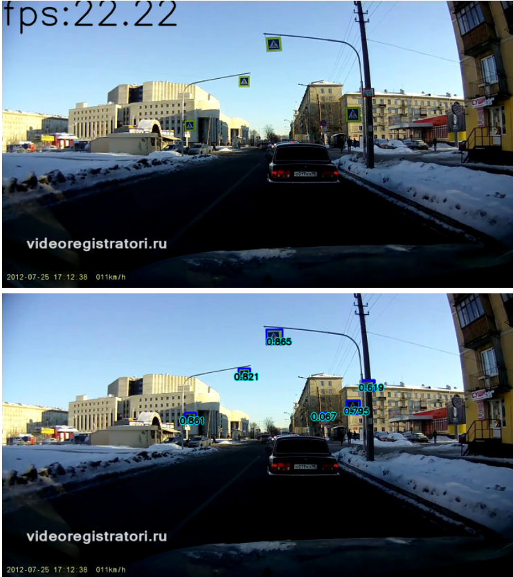

# ADAS System

### Sign Detection&Recognition

# Содержание репозитория

* data - папка для датосетов, .csv и прочего(?), необходимого для обучения. Ноутбуки сами заполняют папку, в случае, если запущены из Google Colab.
* docs - доп. ознакомительные доки.
* notebooks - папка с ноутбуками. Ее необходимо сделать домашней директорией при запуске

        git clone https://github.com/lsd-maddrive/adas_system
        cd adas_system/noteboos
> Внутри notebooks в папке nt_helper вспомогательные файлы для работы ноутбуков

# Описание ноутбуков
* 1_ClassifierResearch - классификатор resnet18 для распознования знаков. В ходе обучения сохраняет веса в data/resnet18_rtsd_test. (<b>FIX ME</b>)
* 2_YoloDetection - детектор на основе YoloV5. В ходе обучения сохраняет веса в notebooks/YoloV5Last.pt. При обучении в Google Colab сохраняет итерации обучения в корень гугл диска.
* VideoTest - использует YoloV5 для демонстрации на видео с регистратора (data/reg_videos/1.mp4)

# Как запустить
## Для ноутбуков 1_ClassifierResearch или 2_YoloDetection
В ноутбуках 1 или 2 исправить флаг

    SHOULD_I_TRAIN = True для запуска обучения,
                     False для теста, загрузки имеющихся весов

Вкладка TEST MODEL позволяет вызвать модель на произвольные данные.

## Для ноутбука VideoTest
Запустить ноутбук целиком, для проигрывания тестового видео с демонстрацией работы детектора

# TO DO
- [ ] Метрики по классификатору
- [ ] Расположение весов классификатора перенести [data -> notebooks? ]
- [ ] Рефактор датасетов
- [ ] Метрики детектора
- [ ] DeepSort для детектора
- [ ] Рефактор кода
- [ ] Поддержка TPU? uoss.py err

# Используемые датасеты
| Название | Описание | Источник |
|-|-|-|
| RTSD Public | Состоит из нескольких частей, включая "full-frames" -  размеченные кадры с видеорегистратора; "detection" - датасет для детекции вобще всего, включая края дороги; "classification" - датасет для классификации знаков | [Ссылка](https://disk.yandex.ru/d/TX5k2hkEm9wqZ)     [Источник ссылки](https://github.com/sqrlfirst/traffic_sign_work) |
| GTSRB | Немецкий набор знаков, в случае нехватки буду брать отсюда | [Ссылка](https://www.kaggle.com/meowmeowmeowmeowmeow/gtsrb-german-traffic-sign) |

>Из RTSD собирается pandas.DataFrame, который является входом DataLoader'ов моделей

# Пример работы:
### Классификатор примеры

?

### Детектор примеры

