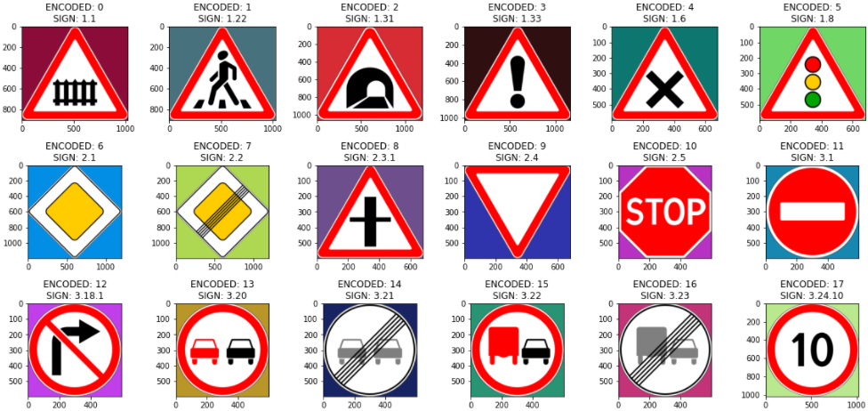
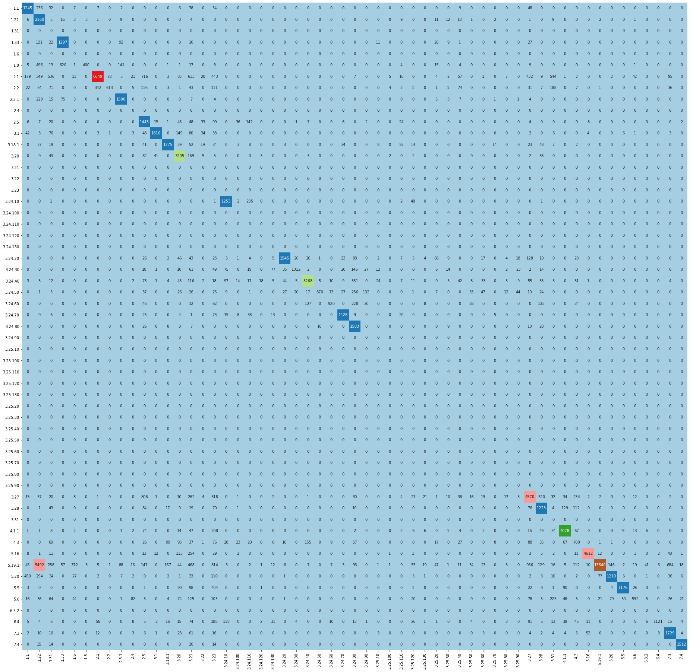
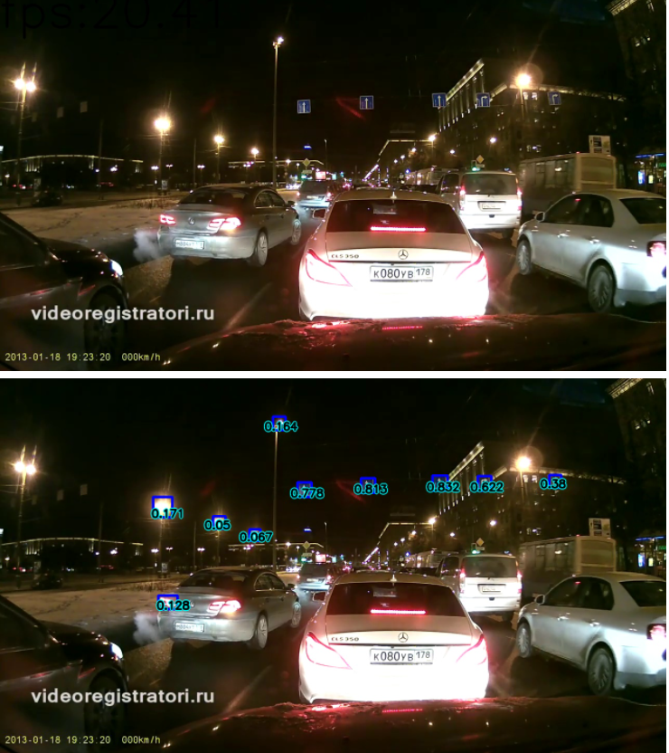
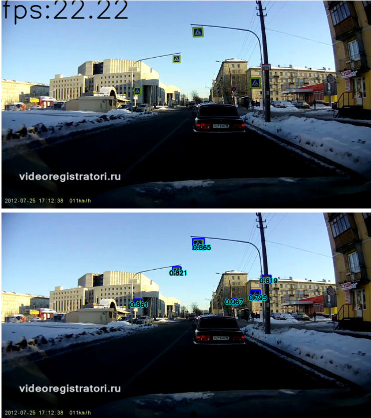

# ADAS System

### Sign Detection&Recognition

# Содержание репозитория

* data - папка для датосетов, .csv и прочего(?), необходимого для обучения. Ноутбуки сами заполняют папку, в случае, если запущены из Google Colab.
* docs - доп. ознакомительные доки.
* notebooks - папка с ноутбуками. Ее необходимо сделать домашней директорией при запуске

        git clone https://github.com/lsd-maddrive/adas_system
        cd adas_system/noteboos
> Внутри notebooks в папке nt_helper вспомогательные файлы для работы ноутбуков.

> В репозитории приложены веса к классификатору (data/{CLASSIFIER, CLASSIFIER_ON_STOCK, YoloV5.pt}.

# Описание ноутбуков
* 1.0.ClassifierResearch - классификатор resnet18 для распознования знаков. В ходе обучения сохраняет веса в data/ как промежуточные так и послении. При обучении в Google Colab сохраняет итерации обучения в корень гугл диска.
* 1_1_Classifier_Issue4 - попытка обучить классификатор на паке стандартных изображений.

* 2.0.YoloDetection - детектор на основе YoloV5. В ходе обучения сохраняет веса в notebooks/YoloV5Last.pt. При обучении в Google Colab сохраняет итерации обучения в корень гугл диска.
* DetectorVideoTest - использует YoloV5 для демонстрации на видео с регистратора (data/reg_videos/1.mp4)
* COMPOSER - Аналогично DetectorVideoTest, но объединение детектора и классификатора сразу.
* RTSD-R_MERGED - создает удобный формат из RTDS. Вероятно не запуститься :(

# Как запустить
## Для ноутбуков 1_ClassifierResearch или 2_YoloDetection
В ноутбуках 1 или 2 исправить флаг

    SHOULD_I_TRAIN = True для запуска обучения,
                     False для теста, загрузки имеющихся весов

Вкладка TEST MODEL позволяет вызвать модель на произвольные данные.

## Для ноутбука VideoTest
Запустить ноутбук целиком, для проигрывания тестового видео с демонстрацией работы детектора

# TO DO
- [x] Softmax confidence для классификатора
- [x] Метрики по классификатору
- [x] Рефактор датасетов
- [ ] Метрики детектора
- [ ] DeepSort для детектора
- [ ] Рефактор кода
- [ ] Поддержка TPU? loss.py err

# Используемые датасеты
| Название | Описание | Источник |
|-|-|-|
| RTSD Public | Состоит из нескольких частей, включая "full-frames" -  размеченные кадры с видеорегистратора. Весит около 18 гб. К нему прилогается csv с координатами знаков. Однаков, не все изображения размечены. Ноутбук детектора скачает укороченную версию (около 6 гб, что позволит спокойно использовать ее в Google Colab) этой части датасета, содержащую только размеченные данные; "detection" - датасет для детекции вобще всего, включая края дороги; "classification" - датасет для классификации знаков | [Ссылка](https://disk.yandex.ru/d/TX5k2hkEm9wqZ)     [Источник ссылки](https://github.com/sqrlfirst/traffic_sign_work) |
| GTSRB *Recognition* | Немецкий набор знаков, в случае нехватки буду брать отсюда | [Ссылка](https://www.kaggle.com/meowmeowmeowmeowmeow/gtsrb-german-traffic-sign) |
| GTSDB *Detection* | Аналогично предыдущему | [Ссылка](https://www.kaggle.com/safabouguezzi/german-traffic-sign-detection-benchmark-gtsdb) |

>Датасеты пакуются в pandas.DataFrame, который является входом DataLoader'ов моделей

>RTSD Public не содержит 14 необходимых знаков: 1.6, 1.31, 2.4, 3.21, 3.22, 3.23. 3.24 (90, 100, 110, 120, 130), 3.25, 3.31, 6.3.2.

# Классификатор
> ### КЛАССИФИКАТОР ОБУЧЕН НА ПАКЕ СТАНДАРТНЫХ ИЗОБРАЖЕНИЙ ЗНАКОВ. Пример:
Пример 1 | Пример 2
:-------------------------:|:-------------------------:
 | 

Точность на RTSD (содержит не все знаки из стандартного пака) - 67.1%

### Матрица конволюции:

> 5.19.1 (объединен с 5.19.2) может распозноваться как 1.22

### Classification Report под спойлером

Classification Report

| precision    | recall | f1-score | support |        |
|--------------|--------|----------|---------|--------|
| 1.1          | 0.60   | 0.74     | 0.66    | 1684   |
| 1.22         | 0.22   | 0.95     | 0.36    | 2273   |
| 1.31         | 0.00   | 0.00     | 0.00    | 0      |
| 1.33         | 0.63   | 0.80     | 0.70    | 1618   |
| 1.6          | 0.00   | 0.00     | 0.00    | 0      |
| 1.8          | 0.99   | 0.26     | 0.41    | 1800   |
| 2.1          | 0.94   | 0.61     | 0.74    | 10934  |
| 2.2          | 0.88   | 0.35     | 0.51    | 1734   |
| 2.3.1        | 0.81   | 0.81     | 0.81    | 1863   |
| 2.4          | 0.00   | 0.00     | 0.00    | 0      |
| 2.5          | 0.37   | 0.74     | 0.50    | 1949   |
| 3.1          | 0.96   | 0.78     | 0.86    | 2309   |
| 3.18.1       | 0.80   | 0.73     | 0.76    | 1735   |
| 3.20         | 0.77   | 0.89     | 0.83    | 3600   |
| 3.21         | 0.00   | 0.00     | 0.00    | 0      |
| 3.22         | 0.00   | 0.00     | 0.00    | 0      |
| 3.23         | 0.00   | 0.00     | 0.00    | 0      |
| 3.24.10      | 0.78   | 0.81     | 0.80    | 1543   |
| 3.24.100     | 0.00   | 0.00     | 0.00    | 0      |
| 3.24.110     | 0.00   | 0.00     | 0.00    | 0      |
| 3.24.120     | 0.00   | 0.00     | 0.00    | 0      |
| 3.24.130     | 0.00   | 0.00     | 0.00    | 0      |
| 3.24.20      | 0.92   | 0.71     | 0.80    | 2180   |
| 3.24.30      | 0.95   | 0.62     | 0.75    | 1634   |
| 3.24.40      | 0.91   | 0.75     | 0.82    | 4378   |
| 3.24.50      | 0.97   | 0.50     | 0.66    | 1734   |
| 3.24.60      | 0.89   | 0.57     | 0.70    | 1600   |
| 3.24.70      | 0.92   | 0.87     | 0.89    | 1645   |
| 3.24.80      | 0.54   | 0.93     | 0.68    | 1617   |
| 3.24.90      | 0.00   | 0.00     | 0.00    | 0      |
| 3.25.10      | 0.00   | 0.00     | 0.00    | 0      |
| 3.25.100     | 0.00   | 0.00     | 0.00    | 0      |
| 3.25.110     | 0.00   | 0.00     | 0.00    | 0      |
| 3.25.120     | 0.00   | 0.00     | 0.00    | 0      |
| 3.25.130     | 0.00   | 0.00     | 0.00    | 0      |
| 3.25.20      | 0.00   | 0.00     | 0.00    | 0      |
| 3.25.30      | 0.00   | 0.00     | 0.00    | 0      |
| 3.25.40      | 0.00   | 0.00     | 0.00    | 0      |
| 3.25.50      | 0.00   | 0.00     | 0.00    | 0      |
| 3.25.60      | 0.00   | 0.00     | 0.00    | 0      |
| 3.25.70      | 0.00   | 0.00     | 0.00    | 0      |
| 3.25.80      | 0.00   | 0.00     | 0.00    | 0      |
| 3.25.90      | 0.00   | 0.00     | 0.00    | 0      |
| 3.27         | 0.68   | 0.64     | 0.66    | 7098   |
| 3.28         | 0.53   | 0.68     | 0.59    | 1789   |
| 3.31         | 0.00   | 0.00     | 0.00    | 0      |
| 4.1.1        | 0.91   | 0.88     | 0.89    | 4659   |
| 4.3          | 0.50   | 0.42     | 0.46    | 1657   |
| 5.16         | 0.98   | 0.90     | 0.94    | 5144   |
| 5.19.1       | 0.99   | 0.57     | 0.72    | 24109  |
| 5.20         | 0.84   | 0.52     | 0.64    | 2320   |
| 5.5          | 0.94   | 0.61     | 0.74    | 1921   |
| 5.6          | 0.83   | 0.34     | 0.48    | 1730   |
| 6.3.2        | 0.00   | 0.00     | 0.00    | 0      |
| 6.4          | 0.99   | 0.58     | 0.73    | 1947   |
| 7.3          | 0.64   | 0.88     | 0.75    | 1957   |
| 7.4          | 0.96   | 0.96     | 0.96    | 1575   |
| accuracy     | 0.67   | 103736   |         |        |
| macro avg    | 0.43   | 0.38     | 0.38    | 103736 |
| weighted avg | 0.86   | 0.67     | 0.72    | 103736 |

# Пример работы:
## Классификатор примеры
Пример 1 | Пример 2
:-------------------------:|:-------------------------:
 | 

>CONF_THRES = 0.8
> * Зеленым отмечены верно определенные с  уровнем уверенности > CONF_THRES
> * Красным отмечены неверно определенные с уровнем уверенности > CONF_THRES
> * Желтым отмечены верно определенные с  уровнем уверенности <= CONF_THRES
> * Серым отмечены неверно определенные с уровнем уверенности <= CONF_THRES

## Детектор примеры
Пример 1 | Пример 2
:-------------------------:|:-------------------------:
 | 

## Детектор+Классификатор примеры
Пример 1 | Пример 2
:-------------------------:|:-------------------------:
  | 

> Подписан знак:уверенность классификатора:уверенность детектора.
